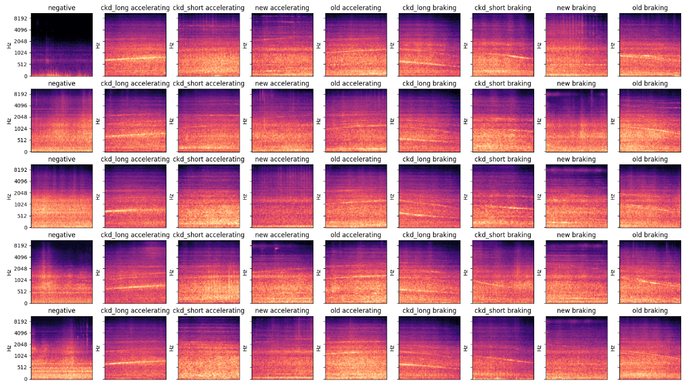
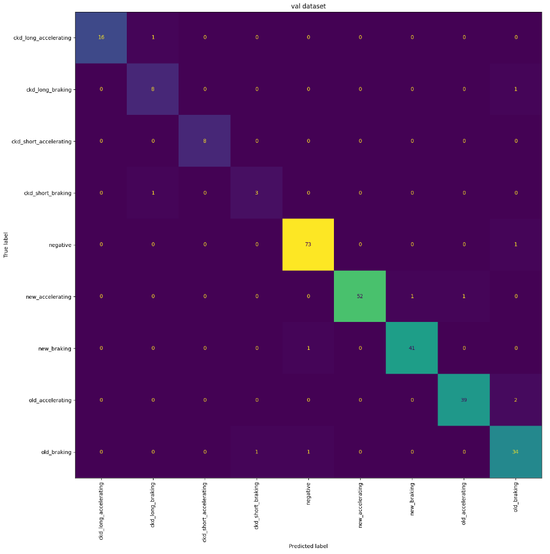

# 🚋 Tram Shazam 🚋

Using ML to classify and sequence audio recordings of a tram stop. 

## Usage Instructions
To run the service, follow these steps:
1. Clone the repository.
2. Create and activate a new virtual environment with Python 3.11.
3. Install used packages with for example `pip install -r requirements.txt`.
4. If you want to run training or data exploring scripts, the dataset containing audio files must be unzipped
   in the project's root folder.
   If needed, adjust the `DATASET_PATH` path variable in `/common/constants.py`.
   Inference can be run without the dataset by providing a path to the `.wav` file to be sequenced (more info below).

## Modelling Approach

### Ideas
Several possible approaches came to my mind during implementation, I'll summarize my thoughts here, and later I'll
describe the actual approach I took for the model that is currently used for inference.

The overarching goal is to create a model that, given a short audio track, describes what's happening in the track, and
then apply this model on a long audio track for inference by iteratively sliding the model across the track's subsegments. 

#### Model Architecture
Given that the classification essentially consists of two groups of targets (tram type + accelerating/braking),
we could consider comparing two architectures:
* A simple model, that predicts the specific combination of tram type and movement type simultaneously.
* A layered model, where the first layer predicts the type of movement of a tram, and a second layer then
  predicts the tram's type (the model(s) in the 2nd layer could also be dependent on the predicted movement type).
  Intuitively, predicting movement type should be the easier of the two tasks, hence I'd use this binary classification
  as the first layer.
  * If discerning between tram noise / negative noise, we could start with yet another layer doing this, or we could
    modify the first layer.

#### About Negative Noise
The usage of negative noise is probably the most interesting riddle about this task. We could create a model that
has negative noise as one of its targets and is capable of explicitly predicting that the input audio contains noise only.
Or the model could be concerned only with tram and movement types, thus predicting the presence of noise solely by not
detecting any tram. Or, once more, the available negative noise tracks could be used only as means to reduce noise in tracks with trams,
cleaning them and producing better training datasets. This final approach could of course be combined with the former two.

### Final Model

The currently used model is a convolutional network trained on spectrograms of individual audio tracks and predicts whether the
track contains only negative noise, or if there's a tram, what type is it, and if it's accelerating or breaking.
(i.e., it's a multiclass classification problem with 9 possible classes).
There's only one model, i.e., no multilayered solution as suggested above. Negative noise is used as an explicit target,
and later we'll use it for noise reduction as well.

During inference, the model is applied on strides of the input audio track.

## Report
I'll go through the main scripts one by one to describe its functions and results, plus I'll add my thoughts and decisions.

### Basic Data Exploration -- `explore_data.py`
The script:
* Counts the number of audio samples in the training dataset, per tram type, movement type, and their combinations.
* Displays basic statistics about the samples' durations and plots a histogram of durations per class.
* Displays 95th percentile of sample duration per class.
* Displays a grid of spectrograms for randomly selected tracks from each class.

#### Comments
* There is a smaller number of recordings of CKD trams. Depending on the model's metrics, we could think about upsampling (or data augmentation).
##### About duration
* To make things easier, I wanted all training samples to have the same duration. I assume that the tram sounds are 
  roughly equal in duration and any unusually long tracks are due to errors in recording.
  * Negative tracks are much longer than tram tracks, but this is not an issue.
    During preprocessing I'll trim these to have the same length as tracks with tram sounds.
  * The histogram of track durations shows that there are some tracks with trams that are much longer than others.
  * I calculated the 95th percentile of track duration for each of the tram types. It shows that by using only tracks
    that are shorter than 6 seconds, we lose less than 5% of the training dataset.
    It's a shame, but it seems like a reasonable compromise, hence this is implemented in the final model.
* Given more time, even the longer tracks could be processed without too much effort. We could:
  * Trim them down to parts with actual tram sounds. However, there is a lot of background noise in the tracks,
    so this would probably have to be coupled with noise reduction.
  * We could use a simple model that detects a tram sound and trims the track.
  * I intentionally didn't want to take the other way and pad the short tracks either with zeros or negative noise.
    I'd say that during inference, it will be more useful to have a model that works with shorter snippets of audio.
    Likewise, I didn't want to squash the long tracks to some desired duration, as it feels like a destructive operation
    when working with sound.

##### Spectrograms
* Looking at the grid of spectrograms, I start to hope that this task is doable. In a lot of the images,
  I can see a clear line revealing the presence of a tram, with upward slopes for accelerating trams and downward
  slopes for trams slowing down. Moreover, different tram types seem to appear in different parts of the spectrum,
  even though here the difference is not so clear-cut.

### Training a Baseline Model -- `train_baseline_model.py`
At first, I wanted to quickly check whether one can create a simple model as a baseline, without much work and
data transformations. I used a feedforward neural network with three hidden layers and ReLU activation functions
trained on raw audio time series with preprocessing consisting only of unification of the samples' durations.

I did not spend too much time on this as the model didn't seem to learn anything useful, so I quickly left for training
a model on spectrograms.

### Training a Model on Spectrograms -- `train_spectrogram_model.py`

Seeing the promising nature of spectrograms described above, I wanted to see how a standard CV model scores on this dataset.
I didn't want to spend time on defining the model's architecture, so I used a rather standard network with 4 convolutional layers
followed by a dense layer and an output layer. As loss function I used cross entropy and for optimization I used the Adam optimizer.

This model is quite surely an overkill and similar results could be achieved with something much more light weight.

All that remained in the preprocessing pipeline is unification of samples' durations. I briefly experimented with 
other audio operations such as trimming, but these would need much more tweaking to work meaningfully.

I trained two version of this model: one with and one without noise reduction.

#### Without noise reduction
After a couple of manual trials around adjusting the batch size, learning rate, and parameters of the convolutional layers,
I got a model with the following metrics:
* lowest train set loss: 0.045 
* lowest test set loss 0.094, highest accuracy 97.5% 
* results on a held-out validation set: loss 0.123, accuracy 96.1%

Given these number that I find satisfying, I decided not to do any formal hyperparameter search.

Looking at the development of loss on train and test datasets per epoch, it seems I've nearly reached a point of optimal fit.
The test loss converges with strong oscillations, this should be investigated further. Maybe the learning rate
does not adapt as it should?

The confusion matrix for the validation set shows that the model is indeed accurate. The only noteworthy
exception might be differentiating between old braking trams and old accelerating trams, where the error rate is quite high.

#### With noise reduction
Here I've used the same model as above, but this time with noise reduction. For each sample a random negative noise track
is chosen and used to filter out background noise. These are the results:
* lowest train set loss: 0.073 
* lowest test set loss 0.111, highest accuracy 96.5% 
* results on a held-out validation set: loss 0.131, accuracy 96.5%

When compared to metrics of the first model, we've achieved worse result on train and test sets, but got a model
that seems to generalize better on the validation set.

### Sequencing an Audio Track -- `sequence_track.py`
This script loads the model trained in the previous step and uses it to detect trams in the input audio file.
It does so by iteratively sliding a time window across the track and applying the model at each step. Its outputs are
probabilities of a given tram and movement type for the given window, these are then transformed into the desired output format.
The output is saved as a `.csv` file, additionally a timeline of the probabilities is displayed.

Currently, the sequencer only supports the first model from the section above, i.e. without noise reduction.

The file path of the audio track to be sequenced is provided to the script via an argument when triggering the script from your command line.

Here's an example output when sequencing audio file `tram-2018-11-30-15-30-17.wav`:

## Final Thoughts

Note that due to time pressure, there are two major areas of flaws:
1. In this document, I oftentimes base my thoughts and decisions on intuition, even though some of them might not be
   intuitive at all, even less so correct.
   In a better scenario, I'd test and compare my alternatives more thoroughly.
2. The code base is functional in the least-amount-of-fraction way. There will be tons of edge (or not so edge) cases
   that the code does not cover, I try to point these out in this text or in the code itself.

#### About negative noise, again
The way negative noise is used in the repo is far from ideal.
* First of all, I use a random track with negative noise for each tram track. Ideally, there'd be some matching algorithm to 
  choose an appropriate combination. For example, we can assume that the time of day strongly affects the background noise,
  we can thus find negative noise whose time of recording closely matches that of the track itself. Similarly, we could
  assume that weather affects the recordings as well and try to test this knowledge, were the data available.
* Should noise be reduced also for tracks with negative noise only? Again, this would have to be tested.

If the script were used for detecting trams at a different location, it would likely fare much worse. The tram
sounds themselves would be similar, but they'd be embedded in a different background noise that the model is 
currently unaware of. I believe that addressing noise reduction would make the model much more flexible.

#### Spectrograms
The spectrograms' parameters should be considered as hyperparameters of the model, I only played around with them for a while
and compared the results manually. The mel-decibel scale with librosa's default values seemed to produce the best outcome,
with spectrograms differentiating the outcome classes the most
(with the important part of the spectrum taking the biggest part of the image).

#### Sequencing flaws
There is a number of issues I'd like to address:
* Sequencing stops once the end of the sliding window reaches the end of the spectrogram. This way, we lose information
  that is contained in the very last part. At least we could pad the end with zeros or negative noise.
* The way it's currently implemented, the sliding window always looks "forward" in time and detects any trams in that segment.
  However, in the output, I mark presence of a tram in the very beginning of the window, even though it might still be seconds away.
* It probably won't be good at detecting situations with more than one tram going by at once. To remedy this, we could create
  our own training samples by combining the ones we have together.
* The final decision is based on a threshold (`is(tram) := P(tram) > thresh`) that I've only set as a rule of thumb. This 
  would really need to be explored and tested further.
* I've noticed situations where the model is quite sure that it's not processing background noise (i.e. `P(negative) < 0.6`),
  but at the same time it's unsure about the class of tram. A couple of them have similar output probabilities and as
  a result, the current implementation does not (wrongly) output a tram signal.
* What I'm missing in the dataset is a ground truth audio track with which I could compare the sequencing output.
  We could create our own by mixing together a couple of the tracks we have at our disposal.

#### Flaws of the current implementation
* I don't like that the preprocessing pipeline is not part of the saved model and has to be initialized separately from the model during inference.
* The whole training dataset is loaded into memory (fine for this small set, but could be an issue otherwise).
* Even though it's loaded into memory, spectrograms are recreated at every epoch the training loop.
* When using noise reduction, I use a different (random) negative noise track at every step and for every data sample.

#### Further steps
* Overall, I consider this task to be a data problem, not a model problem. Given more time, I'd spent it on playing
  with the tracks themselves and their representation. In other words, I think that the output would benefit more
  from preprocessing pipelines that bring out the tram sounds than from a finetuned ML model.
  * I'd look more into different spectrograms and ways of displaying audio.
  * I'd consider more data augmentation. Given the final sequencing use case, I'd try shifting the tracks so that the
    tram sounds are towards the beginning.
  * I'd look into "outlier" removal. The recordings are for example full of sudden bursts of sounds
    (dogs barking, things clashing, people laughing, ...) that shouldn't be hard to detect and remove.
    We know we're looking for long and gradual noises, so these momentary ones do not interest us.
